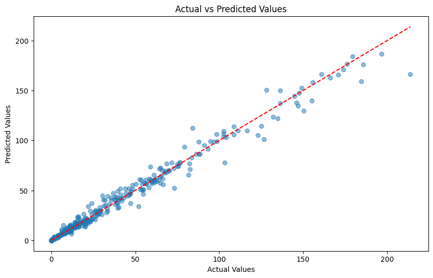
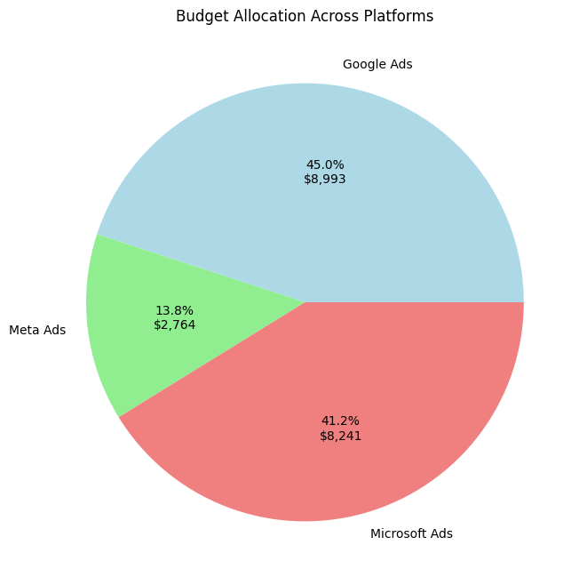

# Ai-media-ecommerce-investment-plan
## Problem Statement
> 
> An AI-driven media investment plan for e-commerce businesses. Based on this analysis, re-allocate the budget across various paid media channels to optimize customer acquisition and conversion rates.

> [!IMPORTANT]  
> We are first making our solution and uploaded as `code1.ipynb` as you can see but a day after uploading it, a Team named [Dual Delight](https://github.com/SAGARGAUD01/AI-Driven-Media-Investment-Plan-) copied the whole project and make it as their own work. so we are diappointed and then again started working fresh and made this project which you can see in `Dazzle-DAV.ipynb` file.

## Our Solution Approach 
> to see our project please open `Dazzle-DAV.ipynb`.
- Data Collection and Preprocessing.
- Data Exploration and Exploratory Data Analysis (EDA).
- Analysing the various parameters and customer's behaviour.
- Analysing trends and patterns to optimize the conversion rates.
- Feature Engineering.
- Apply machine learning techniques to analyze the processed data.
- Finetuning the Parameters of the Best Performing Model.
- Based on the insights gained from the machine learning analysis, reallocate the budget across different paid media channels adhering to the constraints.
- Document the entire process, including data processing, algorithm development, assumptions made, and results obtained.
  
## Results
**Important Features, Based on the heatmap analysis**
* Impressions
* Clicks
* Cost
* Conversions
* Revenue
* Platform
* Click_Through_Rate
* Conversion_Rate
* ROAS
* Cumulative_Cost
* Cumulative_Conversions
  
**Different Model Performances in sorted order**
  
| Model                   | MAE       | MSE         | RMSE      | R²       |
|-------------------------|-----------|-------------|-----------|-----------|
| Random Forest            | 2.288336  | 25.541870   | 5.053897  | 0.983567  |
| Gradient Boosting        | 2.611596  | 25.174673   | 5.017437  | 0.983803  |
| Decision Tree            | 3.219355  | 45.513359   | 6.746359  | 0.970718  |
| Ridge Regression         | 5.685110  | 357.248068  | 18.901007 | 0.770159  |
| Linear Regression        | 5.689408  | 362.280380  | 19.033664 | 0.766921  |
| Lasso Regression         | 5.890350  | 323.349538  | 17.981923 | 0.791968  |
| ElasticNet Regression    | 5.893685  | 323.791383  | 17.994204 | 0.791684  |
| K-Nearest Neighbors      | 6.549829  | 120.158020  | 10.961661 | 0.922695  |
| AdaBoost                 | 7.639852  | 91.834294   | 9.583021  | 0.940917  |
| Support Vector Regressor | 21.094394 | 1452.632683 | 38.113419 | 0.065427  |

**Output Predictions from best model**

**Budget Allocation across different Platforms based on insights from ML**

| Total Budget | $20,000.00      |
|--------------|-----------------|

| Platform       | Allocated Budget |
|----------------|------------------|
| Google Ads     | $8,993.54        |
| Meta Ads       | $2,764.91        |
| Microsoft Ads  | $8,241.55        |

## Future works

1. Enhanced Machine Learning Model for Budget Allocation
    - Implement a dynamic system where the model adjusts budget allocations in real-time based on ongoing campaign performance.
    - Set up pipelines and integrate the ML models into an automated system
2. User Behavior Analysis and Segmentation
    - urther analyze the clusters identified from the PCA and KMeans results to understand the specific behaviors
    - Conduct a time-series analysis on the data to see how user behaviors change over time and adapt marketing strategies accordingly.
3. Advanced Feature Engineering
    - Create new features that capture the temporal aspects of user behavior
4. Long-Term Strategic Planning
    - Use the insights gained from the current models to predict future trends in user behavior and ad performance

## Contributors

- **[Vivek Kumar](https://github.com/NITRR-Vivek)**
- **[Aashutosh Patel](https://github.com/AashuPatel)**
- **[Deepanshu Patel](https://github.com/Deepanshu9229)**
